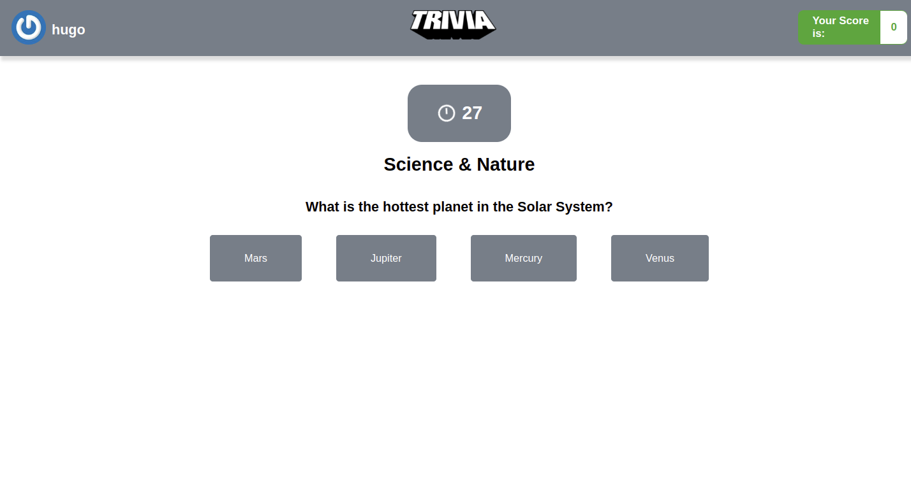

# Projeto Trivia
 
# Contexto
 
Neste projeto foi desenvolvido um jogo de perguntas e respostas baseado no jogo Trivia utilizando React e Redux, desenvolvendo em grupo suas funcionalidades de acordo com as demandas definidas em um quadro Kanban. A partir dessas demandas, teremos uma aplicação onde a pessoa usuária poderá:

* Logar no jogo e, se o email tiver cadastro no site Gravatar, ter sua foto associada ao perfil da pessoa usuária.
* Acessar a página referente ao jogo, onde se deverá escolher uma das respostas disponíveis para cada uma das perguntas apresentadas. A resposta deve ser marcada antes do contador de tempo chegar a zero, caso contrário a resposta deverá ser considerada errada.
* Ser redirecionada, após 5 perguntas respondidas, para a tela de score, onde o texto mostrado depende do número de acertos.
* Visualizar a página de ranking, se quiser, ao final de cada jogo.


O projeto foi realizado em grupo.

### Davi Azevedo
linkedin: https://www.linkedin.com/in/daviazev/

GitHub: https://github.com/daviazev

### Heitor Soares 
linkedin: https://www.linkedin.com/in/heitorsoaresf/

GitHub: https://github.com/heitorsfernandes

### Hugo de Sousa Silva
linkedin: https://www.linkedin.com/in/hugo-de-sousa-dev/

### Thiago Seraphini 
linkedin: https://www.linkedin.com/in/thiago-seraphini-479a189b/

GitHub: https://github.com/ThiagoSeraphini

#



[Acesse o site aqui.](https://hugodesousa.github.io/trivia-game/#/)

## Tecnologias usadas

Front-end:
> Desenvolvido com HTML, CSS e JavaScript.
> React, Redux
 
#
## Executando aplicação
 
* Para o site direto no navegador:
 
 ```
  https://hugodesousa.github.io/trivia-game/#/ 
 ```
* Para rodar em uma máquina local
 
 ```
   No terminal rodar os comandos:
 ```
 ```
   git clone git@github.com:Hugodesousa/trivia-game.git
 ```
 ```
   cd trivia-game
 ```
 ```
   npm install
 ```
 ```
   npm start
 ```
#
### Projeto base fornecido pela Trybe
https://www.betrybe.com/
